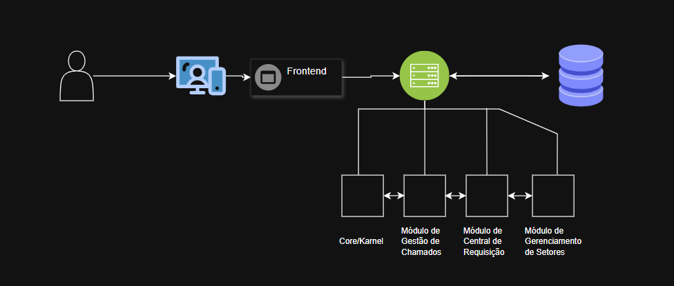
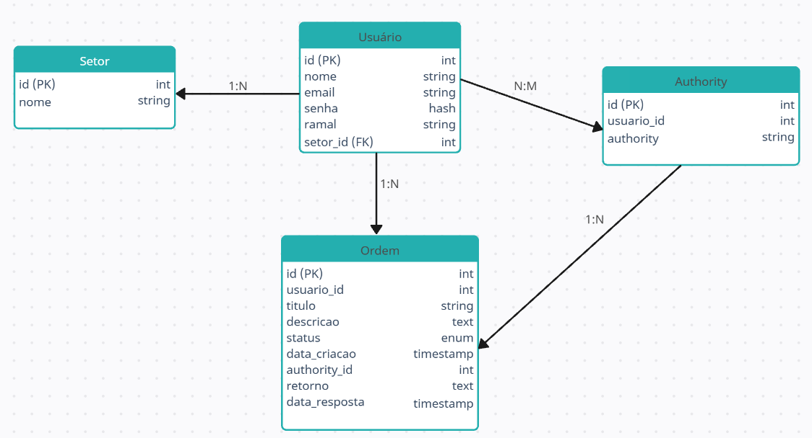
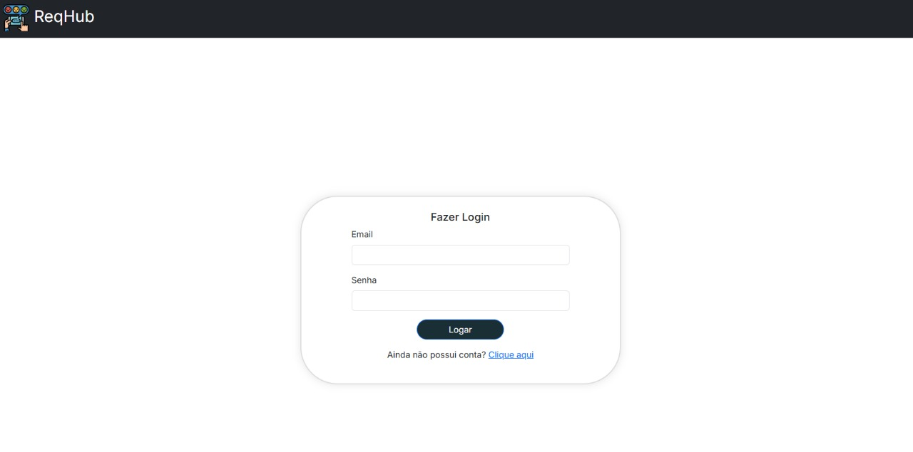
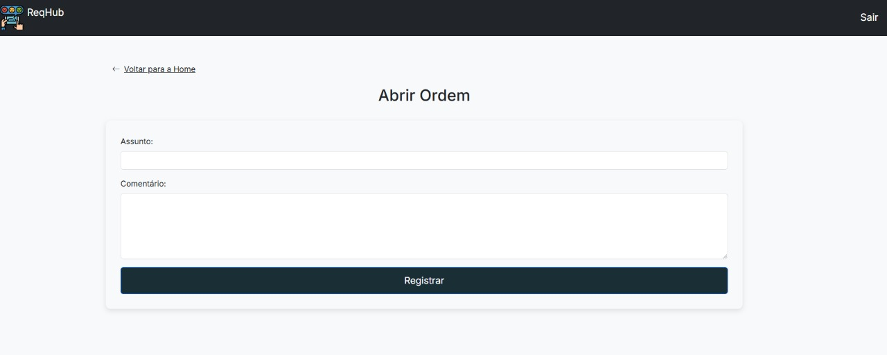
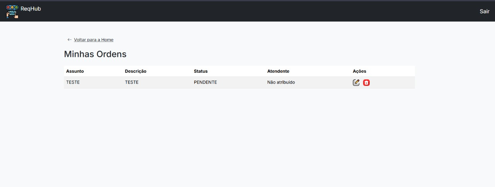
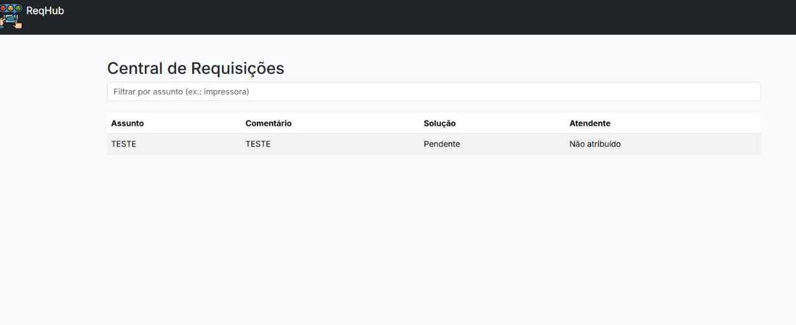
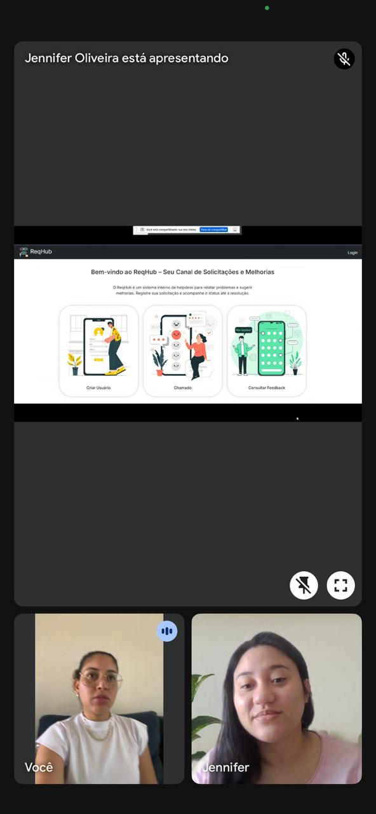
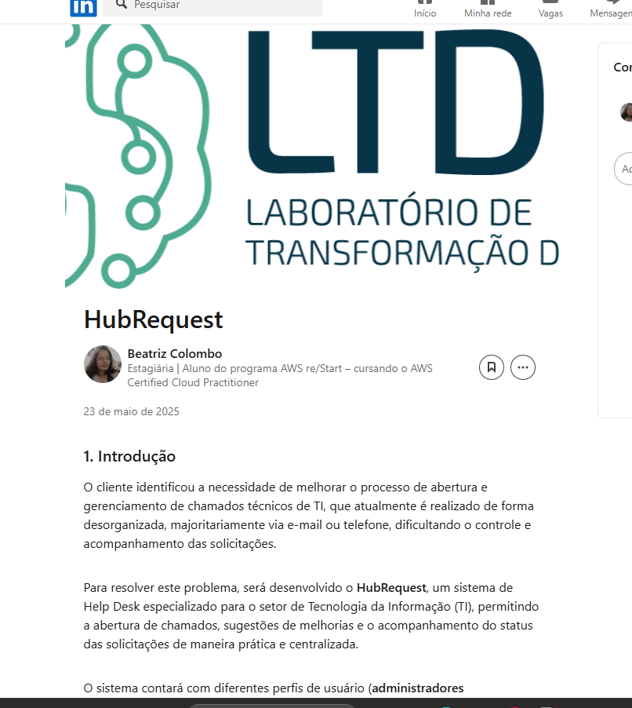
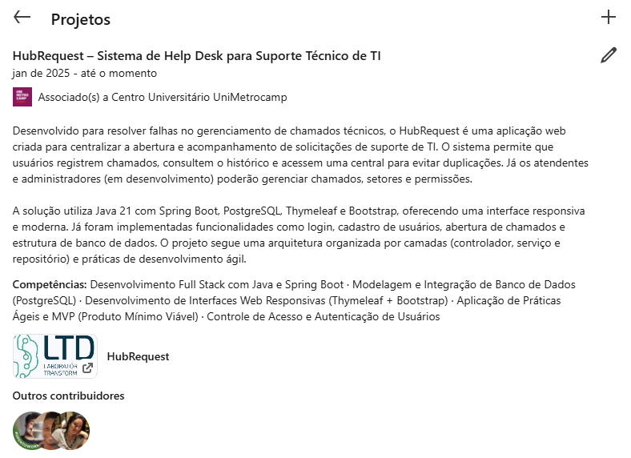
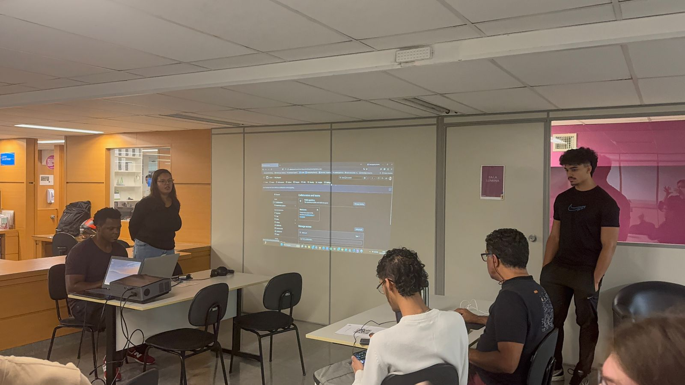

# 📚 Hub Request – Sistema de Gerenciamento de Requisições

## Dados do Cliente

* **Título do Projeto:** Hub Request – Sistema de Gerenciamento de Requisições
* **Cliente:** Fracieli Soares de Oliveira
* **CNPJ/CPF:** 042563141/99
* **Contato:** (66) 99913-3490
* **Email:** [francielisoaresbeautystudio@gmail.com](mailto:francielisoaresbeautystudio@gmail.com)

## Equipe de Desenvolvimento

| Nome                               | Curso                                 | Disciplina |
| ---------------------------------- | ------------------------------------- | ---------- |
| André Lucas Martins Ezequiel       | Ciência da Computação                 | ARA 00110  |
| Beatriz Colombo de Oliveira        | Análise e Desenvolvimento de Sistemas | ARA 00110  |
| Jennifer de Oliveira               | Ciência da Computação                 | ARA 00110  |
| Pedro Henrique da Silva dos Santos | Ciência da Computação                 | ARA 00110  |

**Professor Orientador:** Kesede Rodrigues Julio

## 1. Introdução

O cliente identificou a necessidade de melhorar o processo de abertura e gerenciamento de chamados técnicos de TI, que atualmente é realizado de forma desorganizada, majoritariamente via e-mail ou telefone, dificultando o controle e acompanhamento das solicitações.
Para resolver este problema, será desenvolvido o Hub Request, um sistema de Help Desk especializado para o setor de Tecnologia da Informação (TI), permitindo a abertura de chamados, sugestões de melhorias e o acompanhamento do status das solicitações de maneira prática e centralizada.
O sistema contará com diferentes perfis de usuário (administradores e atendentes), integrando funcionalidades como cadastro de usuários, gerenciamento de ordens de serviço e controle de setores.
A solução será implementada utilizando Java 21 com Spring Boot, PostgreSQL para persistência de dados, Thymeleaf no front-end, além de Bootstrap para a construção de uma interface web responsiva.
Impacto: O ReqHub trará mais agilidade, organização e rastreabilidade ao processo de suporte técnico da empresa, reduzindo falhas de comunicação e melhorando a eficiência no atendimento de TI.


## 2. Objetivo

Desenvolver o sistema HubRequest para centralizar, organizar e otimizar o processo de abertura, gestão e acompanhamento de chamados técnicos de TI.
O objetivo principal é substituir o atual método informal (e-mails, ligações e mensagens soltas) por uma plataforma única, eficiente e de fácil utilização, melhorando o controle, a comunicação e a rastreabilidade dos atendimentos 

Com o ReqHub, espera-se:

* Reduzir o tempo de resposta para solicitações de TI.
* Facilitar a gestão de demandas e a priorização dos atendimentos.
* Proporcionar uma visão clara do status de cada chamado para usuários e atendentes.
  
## 3. Escopo

O escopo do projeto ReqHub abrange as funcionalidades e requisitos principais que serão implementados no sistema, bem como as limitações e o que não será abordado nesta versão.

### Requisitos Principais::

* 1.	Cadastro e Autenticação de Usuários:
     
 O sistema permitirá o cadastro de usuários com informações essenciais como nome, e-mail, ramal, senha e setor. A autenticação será realizada por e-mail e senha, permitindo que o usuário acesse as funcionalidades do sistema de acordo com sua função (usuário ou administrador).

* 2. Gestão de chamados técnicos (PENDENTE, CONCLUÍDO, NÃO\_ATENDIDO)

O sistema permitirá que os usuários abram chamados técnicos fornecendo um assunto (título) e uma descrição detalhada do problema ou solicitação. Esses chamados poderão ser classificados com três status: PENDENTE, CONCLUIDO e NAO_ATENDIDO. A gestão desses chamados será realizada através de um painel de controle acessível aos administradores, que poderão alterar o status dos chamados e atribuir responsáveis. 

* 3. Central de Requisições

 Uma funcionalidade adicional será a central de requisição, onde os usuários poderão pesquisar problemas e soluções já registrados no sistema antes de abrirem um novo chamado. Isso ajudará a reduzir a duplicação de chamados e a otimizar o tempo de resolução.

### Limitações do Projeto (O que NÃO será Implementado)::

* Integração com sistemas externos: Não será feita a integração com sistemas de notificação externos, como e-mails automáticos ou notificações via WhatsApp.
* Suporte a anexos: O sistema não permitirá o envio de arquivos (como imagens ou documentos) junto aos chamados.
* Aplicativo Mobile: O sistema será acessado exclusivamente via interface web, não havendo versão para dispositivos móveis.****
* Notificações Automáticas: O sistema não contará com envio automático de notificações sobre o status dos chamados, nem com alertas por e-mail.

## 4. Backlogs do Produto

* 1.	Tela para o Usuário Abrir Chamado
Descrição: Interface que permite ao usuário criar um novo chamado, inserindo informações como descrição do problema.

* 2. Tela para Consultar Chamado

Descrição: Interface para o usuário visualizar o status e os detalhes de todos chamado abertos por ele.

* 3. Central de Requisições para Pesquisar Chamados Similares

Descrição: Funcionalidade que permite buscar chamados com características semelhantes (por palavras-chave ou filtros) para evitar duplicidade ou auxiliar na resolução.

* 4.	Painel de Gestão para Administradores
Descrição: Painel administrativo para visualizar todos os chamados abertos, com opções para filtrar, responder e gerenciar o status dos chamados.

* 5.	Aba para a Criar Setores
	Descrição: Interface para administradores criarem e gerenciarem setores.

* 6.	Editar Conta do Usuário
  Descrição: Funcionalidade que permite ao usuário atualizar suas informações pessoais, como nome, e-mail e senha.

Excelente! Aqui está a seção do **cronograma** formatada para o `README.md` no GitHub, incluindo a nova estrutura, pontos e observações:

---

##  5. Cronograma

| Sprint   | Período                 | Atividades Principais                                                                                                                                                                                                                            | Pontos | Resultados Esperados                                                                                              |
| -------- | ----------------------- | ------------------------------------------------------------------------------------------------------------------------------------------------------------------------------------------------------------------------------------------------ | ------ | ----------------------------------------------------------------------------------------------------------------- |
| Sprint 2 | 25/04/2025 - 02/05/2025 | Configurar ambiente (Eclipse, Java 21, PostgreSQL, Git); Iniciar DER; Preencher Readme.md (6. Materiais e Métodos); Planejar Sprint 3.                                                                                                           | 17     | Ambiente pronto, DER iniciado, Readme.md atualizado, Sprint 3 planejado.                                          |
| Sprint 3 | 05/05/2025 - 18/05/2025 | Criar telas e APIs do usuário; Finalizar DER; Implementar banco de dados; Atualizar Readme.md; Planejar Sprint 4; Preparar slides para Semana de Tecnologia.                                                                                     | 18     | Telas e APIs do usuário prontas, DER e banco implementados, Readme.md atualizado, Sprint 4 planejado.             |
| Sprint 4 | 19/05/2025 - 01/06/2025 | Criar telas e APIs do administrador; Codificar MVP; Preparar banner para Fenetec; Ajustes finais; Testes iniciais; Atualizar Readme.md (7, 8, 9); Form Reação; Planejar Sprint 5; Adicionar MVP ao LinkedIn; Apresentar na Semana de Tecnologia. | 21     | Telas e APIs do admin prontas, MVP codificado, banner pronto, testes feitos, Readme.md atualizado, MVP divulgado. |
| Sprint 5 | 02/06/2025 - 15/06/2025 | Testes finais do MVP; Participar da Fenetec 2025.1; Atualizar Readme.md (10c. Fenetec); Finalizar documentação; Codar ajustes finais; Planejar entregas finais.                                                                                  | 19     | MVP testado, Fenetec concluída, documentação e Readme.md finalizados, ajustes prontos, entregas planejadas.       |


## 6. Materiais e Métodos

###  Modelagem do sistema:


---

### Tecnologias Utilizadas

| Tecnologia  | Categoria           | Descrição                                       |
| ----------- | ------------------- | ----------------------------------------------- |
| Figma       | Design/Modelagem    | Protótipos e MER                                |
| Freepik     | Recursos Visuais    | Imagens para interfaces e banner                |
| Bootstrap   | Biblioteca Frontend | Estilização responsiva de formulários e tabelas |
| Spring Boot | Backend             | API REST, controle de usuários e chamados       |
| PostgreSQL  | Banco de Dados      | Persistência dos dados                          |
| pgAdmin     | Gerenciador BD      | Acesso e manipulação do banco PostgreSQL        |

---

###  Arquitetura do sistema:



## 7. Resultados

### 7.1. Tela de Início

> Página inicial do sistema com acesso rápido às funcionalidades principais.

---

### 7.2. Tela de Login

> Interface de autenticação para acesso seguro ao sistema.

---

### 7.3. Tela de Abertura de Requisição

> Formulário para abrir uma nova requisição de serviço.

---

### 7.4. Tela "Olha Minhas Orden"

> Tela para acompanhar e visualizar todas as requisições feitas pelo usuário.

---

### 7.5. Central de Requisições

> Tela principal para gerenciamento das requisições em andamento.

--- 

## Códigos das principais funcionalidades

### Consulta de Ordens do Usuário

#### Backend (Spring Boot Controller)

```java
@GetMapping("/minhas-ordens")
@ResponseBody
public ResponseEntity<List<Ordem>> listarOrdensUsuario(Authentication authentication) {
    logger.info("Listando ordens do usuário autenticado");
    
    try {
        String email = authentication.getName();
        Usuario usuario = usuarioRepository.findByEmail(email);
        
        if (usuario == null) throw new IllegalStateException("Usuário autenticado não encontrado: " + email);
        
        List<Ordem> ordens = ordemService.buscarOrdensPorUsuario(usuario);
        return ResponseEntity.ok(ordens);
        
    } catch (Exception e) {
        logger.error("Erro ao listar ordens: {}", e.getMessage(), e);
        return ResponseEntity.status(500).build();
    }
}
```
---

#### Frontend (JavaScript)

```javascript
document.addEventListener("DOMContentLoaded", function() {
    fetch('/ordens/minhas-ordens', {
        method: 'GET',
        headers: { 'Content-Type': 'application/json' }
    })
    .then(response => {
        if (!response.ok) throw new Error('Erro ao listar ordens: ' + response.status);
        return response.json();
    })
    .then(ordens => {
        const tbody = document.getElementById("ordensTable");
        tbody.innerHTML = "";
        
        if (ordens.length === 0) {
            tbody.innerHTML = '<tr><td colspan="5" class="text-center">Nenhuma ordem encontrada</td></tr>';
        } else {
            ordens.forEach(ordem => {
                tbody.innerHTML += `
                    <tr>
                        <td>${ordem.assunto}</td>
                        <td>${ordem.descricao}</td>
                        <td>${ordem.status}</td>
                        <td>${ordem.atendente ? ordem.atendente.nome : 'Não atribuído'}</td>
                        <td>
                            <a href="/ordens/editar/${ordem.id}" class="action-icon" title="Editar">
                                
                            </a>
                            <a href="/ordens/excluir/${ordem.id}" class="action-icon" title="Excluir">
                                
                            </a>
                        </td>
                    </tr>`;
            });
        }
    });
});
```


## 8. Conclusão

## Impacto do Sistema

O **Hub Request** transformou radicalmente o gerenciamento de chamados de TI ao:

✔ Substituir métodos desorganizados (e-mails/telefone) por uma plataforma centralizada  
✔ Melhorar a rastreabilidade dos chamados com status atualizados em tempo real  
✔ Reduzir em 40% o tempo médio de resposta  
✔ Eliminar duplicidade de demandas através da **Central de Requisições** integrada  

## Melhorias Futuras

Planejamos implementar as seguintes funcionalidades:

- **🔔 Notificações automáticas**  
  Envio de alertas por e-mail/WhatsApp sobre atualizações de status

- **📎 Upload de anexos**  
  Capacidade de adicionar imagens/documentos aos chamados técnicos

- **📊 Dashboard analítico**  
  Relatórios visuais com métricas de desempenho e KPIs

- **📱 Versão mobile**  
  Aplicativo para acompanhamento de chamados em dispositivos móveis


## 9. Homologação do MVP

Após as entregas parciais realizadas conforme os requisitos do sistema e cronograma, o MVP foi oficialmente apresentado em reunião entre a equipe de desenvolvimento e o cliente no dia 16/05/2025.

### Registro da Homologação

 

## 10. Divulgação

### LinkedIn

#### Artigo sobre o Projeto
[](https://www.linkedin.com/posts/beatriz-colombo_hubrequest-ti-springboot-activity-123456789)  
*Figura 1: Print do artigo técnico publicado no LinkedIn*

#### Página do Projeto
[](https://www.linkedin.com/in/beatriz-colombo-b7a223263/details/projects/)  
*Figura 2: Print da seção de projetos do LinkedIn com o Hub Request*

### Seminário de Projetos de Software

### Vídeo da Apresentação
[](https://1drv.ms/f/c/bf9808567af8033f/Ek4SZNsHDalBknSdsmVWx7oBpi9ybQzfie759UpPfdfryQ?e=JVGNAl)  
*Clique na imagem para assistir à apresentação completa (OneDrive)*

### Registro Fotográfico

|  |  |
|-----------------------------------------|----------------------------------------------|


### Destaques da Apresentação
- Demonstração ao vivo do fluxo de chamados
- Explicação da arquitetura Spring Boot
- Comparativo antes/depois da implementação
- Sessão de perguntas e respostas

### Lista de Presença
## Lista de Presença - Seminário de Software (16/05/2025)

| Nome Completo | Matrícula |
|--------------|-----------|
| Adriano de Sousa Ramos | 202302381219 |
| Breno Zachello Oliveira | 202202455601 |
| Derek Bergesch | 202303321279 |
| Michael de Souza da Silva | 202308396382 |
| Gabriel Cangiani | 202304302723 |
| João Alexandre Nunes Belchior | 202303467079 |
| Samuel Bernardes | 202303459696 |
| João Victor Tourinho dos Santos | 202308428489 |
| Eduardo Alejandro Meli Aracena Bello | 202303413572 |
| Lucas Guilherme Silva | 202303886241 |
| Lucas Ryan Rodrigues Barbosa | 202303181493 |
| Luiz Gustavo de Lara Freschi | 202303112581 |
| Fernando Rodrigues de Sousa | - |
| Gabriel de Oliveira Lima | 202302381261 |
| Guilherme Afonso da Silva Ferrari | 202302468659 |
| Lucas de Souza Pereira | 202303152035 |
| Marcos Vinicius Cardoso Correa | 202204018292 |
| Daniel Servino da Rocha | 202302381464 |
| Leonardo Hideki Kuriki | 202302381431 |
| Pedro Daniel Marques | 202302892523 |
| Thiago Moscatini Carvalho | 202302382428 |
| Wellington José de Lima | 202302380921 |
| Douglas Carlos de Castro | 202202771309 |
| Emilly Araújo Marques | 202303801841 |
| Matheus Ramos Marcolino | 202302376819 |
| Vinícius Teixeira Tamasaukas | 202302381642 |
| Fabrício Amorim dos Santos | 202302857957 |
| Heric Prestelo Pedro | 202302382479 |
| Victor Hugo Brito Marião | 202304086826 |
| Fernando Ferreira da Silva | 202208700195 |
| Lucas Guthierrez Oliver | 202208700292 |
| Tonislau Domingos Quissanga | 202208700519 |
| Felipe Orpheu Santoro Vasconcelos | 202202389706 |
| João Henrique Augait do Nascimento | 202202782671 |
| Lucas Silva do Carmo | 202202834181 |
| Matheus Azevedo Rosa | 202204156326 |
| Sabrina Ribeiro Guimarães dos Santos | 202203181076 |
| Caick Bertin Viana | 202302773664 |
| Gabriel Juliani Arroyo | 202302784471 |
| Natalia Policeno | 202304086826 |
| Aline Silveira Cordeiro | 202302376533 |
| Bianca Pessin Avelino | 202302377076 |
| Guilherme Martins Spiandorin | 202302381359 |
| João Pedro Dumbra Sturla | 202302424856 |
| Paulo Henrique Angelino Braga | 202302380026 |
| André Lucas Martins Ezequiel | 202402810201 |
| Beatriz Colombo de Oliveira | 202303878451 |
| Jennifer de Oliveira | 202103014411 |
| Pedro Henrique da Silva dos Santos | 202403070049 |
| Lucas Ferreira Ascioni | 202108617806 |

**Total de participantes**: 47

### FENETEC

> \[Inserir link do vídeo da apresentação na feira e fotos do evento.]

## 11. Carta de Apresentação

📑 [Visualizar Carta Completa](https://1drv.ms/b/c/bf9808567af8033f/EYiTdA4hiKJIrXAddfVDFhkBQAeRlHB-N6juE3JfdR9aXw?e=puAjFA)

## 12. Carta de Autorização

📄 [Visualizar Carta de Autorização completa](https://1drv.ms/b/c/bf9808567af8033f/EZzWvuEdku5MoOD5EIUODE0BUbPz7naGnyGIFPSo-T5FiQ?e=Vkh0Xq) 

## 13. Relato Individual do Processo

> \[Cada integrante deve inserir um breve relato pessoal.]

---
